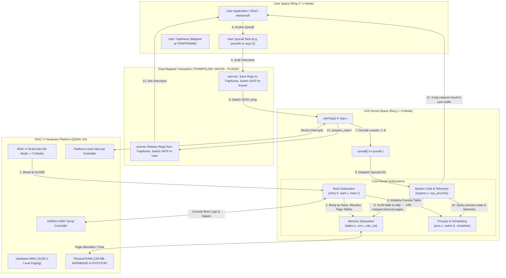

# cOS (Curiosity Operating System) — Architectural Mindmap

**Document Version**: 1.0.0  
**Target Architecture**: RISC-V 64-bit (`rv64gc`) on QEMU `virt` machine  
**Kernel Subsystems Covered**: Boot Sequence, Memory Management, Process Scheduling, Traps & System Calls, and Custom Telemetry (`sys_procinfo`).

---

## 1. Master System Architecture Mindmap

The following visual mindmap breaks down the complete architecture of the **cOS** operating system into its primary subsystems, core implementation files, critical functions, and key design concepts.

```mermaid
mindmap
  root((cOS Architecture))
    Boot Sequence
      Hardware Reset QEMU
        Reset Vector at 0x1000
        Loads Kernel at 0x80000000
      Assembly Bootstrap entry.S
        _entry entrypoint
        Read mhartid CSR
        Per-hart 4KB Stack in stack0
        Jump to start
      Machine Mode Setup start.c
        Configure mstatus MPP to Supervisor
        Set mepc to main
        Disable satp translation satp 0
        Delegate Traps medeleg mideleg
        Enable Supervisor Interrupts sie
        Configure PMP pmpaddr0 pmpcfg0
        timerinit sstc stimecmp
        Save mhartid to tp register
        Execute mret to S-mode
      Supervisor Mode Bring-up main.c
        Hart 0 Bootstrap Processor
          consoleinit and printkinit
          cOS ASCII Art Splash Screen
          kinit Physical Memory Allocator
          kvminit and kvminithart Sv39 Paging
          procinit Process Table and KStacks
          trapinit and trapinithart stvec
          plicinit and plicinithart IRQs
          binit iinit fileinit Storage Cache
          virtio_disk_init Block Device
          userinit Launch First Process
          atomic_store started Release Barrier
        Secondary Cores Harts 1..N
          atomic_load started Acquire Spin
          kvminithart Enable Paging
          trapinithart Local Trap Vector
          plicinithart Local Interrupts
          Enter scheduler Loop
    Memory Management
      Physical Page Allocator kalloc.c
        Usable RAM KERNBASE to PHYSTOP 128MB
        Intrusive Singly Linked freelist
        kinit and freerange
        kalloc 4096B Allocation and Poisoning
        kfree Page Deallocation and Poisoning
      Virtual Memory Subsystem vm.c
        Sv39 Three-Level Page Table
          39-bit Virtual Address VA
          VPN2 VPN1 VPN0 9 bits each
          Page Offset 12 bits
          512 Page Table Entries per page
          PTE Flags V R W X U
        walk Software MMU Page Table Walker
        mappages Map Range of Virtual Pages
        kvmmake and kvmmap Kernel Direct Map
        kvminithart SATP and sfence_vma
        uvmcreate and uvmfree User Tables
        uvmalloc and uvmdealloc Heap Growth
        uvmcopy Fork Address Space Clone
        uvmclear User Stack Guard Page
        copyin and copyout Memory Crossing
        vmfault Demand Paging Handler
        calc_rss Resident Set Size Walker
    Processes and Scheduling
      Process Lifecycle proc.h
        States UNUSED USED RUNNABLE RUNNING SLEEPING ZOMBIE
        Process Control Block struct proc
        Per-process Kernel Stack KSTACK
        Per-process User Trapframe
      Process Management proc.c
        procinit Lock and Stack Initialization
        allocproc Allocate PID and Resources
        freeproc Reclaim PCB and Page Tables
        userinit Create Initial Process
        growproc Heap Growth for sbrk
        kfork Clone Process for fork
        kexit Process Termination and Reparent
        kwait Child Reaping and Exit Status
        sleep_prepare and sleep Two-Phase Sleep
        wakeup Resume Sleeping Waiters
      Context Switching and Scheduler
        swtch.S Assembly Context Switch
          Save Callee Regs ra sp s0-s11
          Restore Target Callee Regs
        scheduler Per-CPU Round-Robin Loop
        sched Context Switch to Scheduler
        yield Involuntary Preemption on Tick
    Traps and System Calls
      Privilege Transitions
        trampoline.S Dual-Mapped Page
          uservec User to Kernel Switch
          userret Kernel to User Switch
        trap.c usertrap User Trap Dispatcher
        trap.c kerneltrap Kernel Interrupts
        kernelvec.S Supervisor Interrupt Vector
        prepare_return Prepare U-Mode Return
      System Call Subsystem
        syscall.h Syscall Numbers 1 to 23
        syscall.c Function Dispatch Table
        Argument Decoding argint argaddr argstr
        System Call Execution and Retval in a0
      Custom Telemetry sys_procinfo 23
        sysproc.c sys_procinfo
        struct proc_info 11 Introspection Fields
        Kernel Telemetry Instrumentation
          cpu_ticks Accumulated Timer Ticks
          ctx_switches Total Context Switches
          page_faults Handled Demand Faults
          total_syscalls Cumulative Calls
          syscall_counts 32-Entry Histogram
        calc_rss Sv39 MMU Page Directory Walk
        Concurrency Discipline Spinlock Drop
        Validation testsyscall.c 6 Scenarios
```

---

## 2. Subsystem Interaction & Dataflow Diagram

The diagram below illustrates the runtime interaction between the hardware, trap vectors, kernel subsystems, and user-space applications:

---

## 3. Detailed Explanatory Commentary & Mindmap Navigation

### 3.1 Subsystem 1: The Boot Sequence
The boot sequence establishes hardware execution contexts and coordinates multi-core CPU bring-up:
1. **Reset & Assembly Bootstrap (`entry.S`)**:
   - The hardware reset vector in QEMU begins execution in RISC-V **Machine Mode** (M-mode) at `0x80000000`.
   - Every physical core (*hart*) executes `_entry`. Each hart discovers its ID via the `mhartid` Control and Status Register (CSR).
   - Each core calculates its private 4096-byte stack in the static array `stack0`:
     $$\text{sp} = \text{stack0} + ((\text{mhartid} + 1) \times 4096)$$
   - Cores jump into `start()` in `kernel/start.c`.
2. **Machine Mode Configuration (`start.c`)**:
   - `start()` configures the `mstatus` register to set `MPP = Supervisor`.
   - Writes the address of `main()` into `mepc`.
   - Temporarily disables virtual memory translation by clearing `satp = 0`.
   - Delegates all hardware exceptions and interrupts to Supervisor Mode via `medeleg = 0xffff` and `mideleg = 0xffff`.
   - Configures Physical Memory Protection (`pmpaddr0 = 0x3fffffffffffffull`, `pmpcfg0 = 0xf`) to grant S-mode full access to RAM.
   - Configures the timer via `timerinit()` using the RISC-V `sstc` extension.
   - Persists the hardware `mhartid` into the thread pointer register `tp` (so `cpuid()` in S-mode can read it).
   - Executes `mret`, causing the hardware to drop privilege to S-mode and branch to `main()`.
3. **Supervisor Initialization & SMP Coordination (`main.c`)**:
   - **Bootstrap Processor (Hart 0)**:
     - Initializes console UART and spinlocks (`consoleinit`, `printkinit`).
     - Renders the custom **cOS ASCII art splash screen** and boot announcement.
     - Initializes the physical memory allocator (`kinit`).
     - Builds the master kernel Sv39 page table (`kvminit`) and turns on paging (`kvminithart`).
     - Initializes the process table and allocates per-process kernel stacks (`procinit`).
     - Installs the kernel trap vector (`trapinit`, `trapinithart`).
     - Programs the Platform-Level Interrupt Controller (`plicinit`, `plicinithart`).
     - Brings up disk buffers (`binit`), inodes (`iinit`), file tables (`fileinit`), and block device (`virtio_disk_init`).
     - Spawns the first user process (`userinit`).
     - Unlocks secondary cores via atomic store: `__atomic_store_n(&started, 1, __ATOMIC_RELEASE)`.
   - **Secondary Cores (Harts 1..N)**:
     - Spin-wait on `started` via `__atomic_load_n(&started, __ATOMIC_ACQUIRE)`.
     - Upon release, turn on Sv39 paging (`kvminithart`), install local trap vector (`trapinithart`), enable local interrupt routing (`plicinithart`).
     - Enter the process scheduler loop (`scheduler()`).

---

### 3.2 Subsystem 2: Memory Management & Sv39 Virtual Memory
cOS enforces memory safety and process isolation through a dual-layered memory architecture:
1. **Physical Page Allocator (`kalloc.c`)**:
   - Manages physical DRAM between the end of kernel static data (`end`) and `PHYSTOP` (`0x88000000`, 128 MB).
   - Employs an **intrusive singly linked free list** (`kmem.freelist`). Unused 4096-byte pages are cast directly into `struct run`, achieving zero metadata memory overhead.
   - Guarded by `kmem.lock`.
   - **Defensive Poisoning**: Fills freed pages with `1` in `kfree()` to catch use-after-free bugs, and fills newly allocated pages with `5` in `kalloc()` to catch uninitialized memory reads.
2. **Virtual Memory Management (`vm.c`)**:
   - Implements RISC-V **Sv39** 3-level page tables. A 39-bit virtual address contains:
     - `VPN[2]` (bits 38..30, 9 bits): Level-2 root directory index.
     - `VPN[1]` (bits 29..21, 9 bits): Level-1 intermediate directory index.
     - `VPN[0]` (bits 20..12, 9 bits): Level-0 leaf table index.
     - `Offset` (bits 11..0, 12 bits): Byte offset inside the 4096-byte page.
   - **Core Functions**:
     - `walk()`: Simulates the hardware MMU walk in software. Traverses Level-2 and Level-1 directories, allocating intermediate 4KB tables if `alloc == 1`. Returns pointer to the Level-0 PTE.
     - `mappages()`: Installs PTEs for a contiguous range of virtual addresses.
     - `kvmmake()`: Sets up the kernel's identity mappings (UART, VIRTIO, PLIC, kernel code/data) plus the high-memory `TRAMPOLINE` and per-process `KSTACK`s.
     - `copyout()` / `copyin()`: Robust user-kernel memory boundaries. cOS implements a repository-specific 5-argument `copyout(pagetable, psz, dstva, src, len)` that automatically invokes `vmfault()` when touching lazily-allocated user pages.
     - `calc_rss()`: Traverses the process's page table from virtual address 0 to `p->sz` using `walk(pagetable, va, 0)`. Tallies physical pages that have `PTE_V` (Valid) and `PTE_U` (User) set, accurately measuring true physical Resident Set Size.

---

### 3.3 Subsystem 3: Processes & Scheduling
cOS provides multitasking and fair CPU allocation across multiple cores:
1. **Process Lifecycle (`proc.h` & `proc.c`)**:
   - Process states: `UNUSED` $\rightarrow$ `USED` $\rightarrow$ `RUNNABLE` $\leftrightarrow$ `RUNNING` $\rightarrow$ `SLEEPING` $\rightarrow$ `ZOMBIE` $\rightarrow$ `UNUSED`.
   - The global process table `proc[NPROC]` holds 64 slots.
   - Each process possesses:
     - A private virtual address space (`p->pagetable`).
     - A private user trapframe (`p->trapframe`) mapped at `TRAPFRAME`.
     - A private kernel execution stack mapped at `KSTACK(i)`.
     - A state lock (`p->lock`) protecting its lifecycle transitions.
2. **Context Switching (`swtch.S`)**:
   - Implemented in assembly: `swtch(struct context *old, struct context *new)`.
   - Saves 14 callee-saved registers (`ra`, `sp`, `s0..s11`) of the departing thread and restores the 14 registers of the incoming thread.
   - Does not touch caller-saved registers, as the C calling convention guarantees they are already spilled to the stack.
3. **Round-Robin Scheduling (`scheduler()` & `sched()`)**:
   - Every core runs an infinite `scheduler()` loop.
   - Iterates through `proc[]`, acquiring `p->lock`. When a `RUNNABLE` process is located, transitions state to `RUNNING` and calls `swtch()` to switch from the CPU scheduler context to the process kernel context.
   - When a process yields (`yield()`), sleeps (`sleep()`), or exits (`kexit()`), it invokes `sched()`.
   - **Telemetry Tracking**: Inside `sched()`, cOS increments `p->ctx_switches++`, recording both voluntary yields and involuntary timer preemptions.

---

### 3.4 Subsystem 4: Traps & The System Call Subsystem
1. **Trap Architecture (`trampoline.S` & `trap.c`)**:
   - The `TRAMPOLINE` page is mapped at `MAXVA - PGSIZE` in **both** the user page table and kernel page table.
   - When user code executes `ecall`, hardware traps to `stvec` (which points to `uservec` in the trampoline page).
   - `uservec` saves user registers into `p->trapframe`, loads the kernel stack pointer and kernel page table into `satp`, flushes the TLB, and jumps to `usertrap()` in `trap.c`.
   - `usertrap()` inspects `scause`:
     - System call (`scause == 8`): Advances `p->trapframe->epc += 4`, enables interrupts, and calls `syscall()`.
     - Device interrupt: Invokes `devintr()`. If timer interrupt, increments `p->cpu_ticks++` and calls `yield()`.
     - Page fault (`scause == 13` or `15`): Invokes `vmfault()`. If successful, increments `p->page_faults++`.
   - `prepare_return` and `userret` reverse the sequence, switching back to the user page table and restoring user registers.
2. **Custom Telemetry: `sys_procinfo` (Syscall #23)**:
   - Wired in `kernel/syscall.h` (`SYS_procinfo 23`), `kernel/syscall.c`, and `kernel/sysproc.c`.
   - Exposes comprehensive kernel telemetry to user applications via `struct proc_info`:
     - Process Identification: `pid`, `ppid`, `name`.
     - State & Memory: `state`, virtual size `sz`, Resident Set Size `rss`.
     - Telemetry Counters: `cpu_ticks`, `ctx_switches`, `page_faults`, `total_syscalls`.
     - Execution Profile: `syscall_counts[32]` histogram.
   - **Spinlock Discipline**:
     - Locks `target->lock` to safely snapshot telemetry counters.
     - Calculates `rss` via `calc_rss(target->pagetable, target->sz)`.
     - **Strictly releases `target->lock` before calling `copyout()`**! Because `copyout()` may trigger a page fault and allocate physical memory, calling it while holding a spinlock would violate kernel lock-ordering invariants and trigger a deadlock panic.
   - **Test Suite (`testsyscall.c`)**:
     - Six automated test scenarios verifying self-queries, init process inspection, deterministic syscall counting, lazy page faults, boundary conditions/invalid pointers, and parent-child stat isolation.

---

